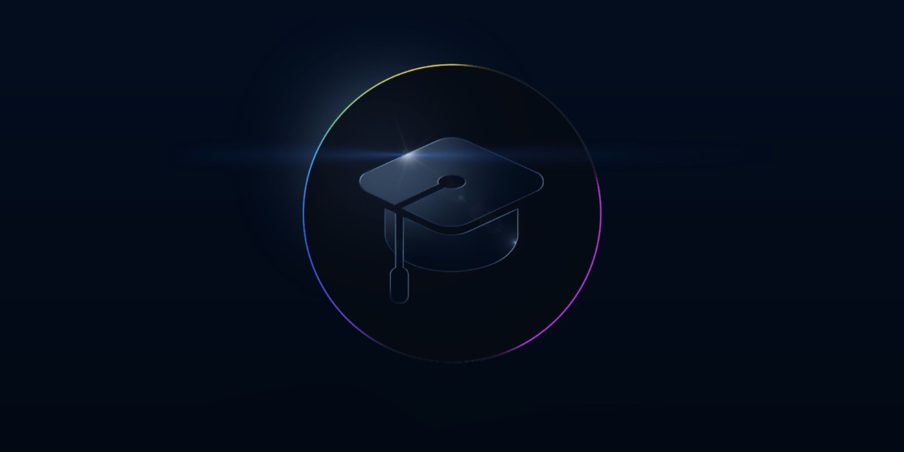

# WWDC 2022 - Swift Student Challenge

List of student submissions for the WWDC 2022 - Swift Student Challenge.

### How to add your submission?
1. [Click here](https://github.com/wwdc/2022/edit/main/Template.md) to fork this repository and edit the `Template.md` file.
2. Fill out the document based on the example in the comment below.
3. Make a new Pull Request and wait for the review.

#### How to update your submission?
If you would like to update your submission status please find your file in `Submission` directory. Edit file, update status and create Pull Request.

### Submissions

| Name | Source |    Video    | Technologies | Status |
|-----:|:------:|:-----------:|:-------------|:------:|
|[Amber Wu](https://github.com/wyy511511)|[GitHub](https://github.com/wyy511511/HockeyTourWithBingDwenDwen)|-|SwiftUI, ARKit, ARQuickLook||
|[Anatole Debierre](https://github.com/a2br)|[GitHub](https://github.com/a2br/vote)|[YouTube](https://www.youtube.com/watch?v=414azCHcAgk)|SwiftUI||
|[Aryan Chaubal](https://github.com/chaubss)|[GitHub](https://github.com/chaubss/Turing-Machine-WWDC22)|-|SwiftUI, AVFoundation||
|[Ataberk Turan](https://github.com/ataberkturan)|[GitHub](https://github.com/ataberkturan/ParkinsonAI)|-|SwiftUI, Combine, CoreML, PencilKit||
|[Audrey Wang](https://github.com/audreyolaf)|[GitHub](https://github.com/audreyolaf/Theia)|[YouTube](https://youtu.be/bLVWnQGnx9s)|SwiftUI, AVFoundation||
|[Ayush Singh](https://github.com/Ayush21082)|[GitHub](https://github.com/Ayush21082/Flip-The-Cup)|[YouTube](https://youtu.be/1zy_tqStrtA)|SwiftUI, SceneKit, ARKit||
|[Bartłomiej Pluta](https://github.com/bpluta)|[GitHub](https://github.com/bpluta/Pwnground)|-|SwiftUI, Combine||
|Bedir Ekim|[GitHub](https://github.com/BedirEkim/Securencrypt-WWDC22)|-|SwiftUI, Vision||
|Berkin Ceylan|[GitHub](https://github.com/berkinceylan/WWDC22)|-|SwiftUI, CoreML||
|[Bon Sung Koo](https://github.com/terry-koo)|[GitHub](https://github.com/terry-koo/WWDC_Colors_SwiftUI)|-|SwiftUI||
|[Bryanza Novirahman](https://github.com/bryanzanr)|[GitHub](https://github.com/bryanzanr/drawer)|[YouTube](https://youtu.be/ZIRQrQKmxsQ)|SwiftUI||
|[Byeon Jinha](https://github.com/Byeonjinha)|[GitHub](https://github.com/Byeonjinha/CooC_Archive)|-|SwiftUI||
|[Carl Voller](https://www.linkedin.com/in/carl-ian-voller)|[GitHub](https://github.com/Portatolova/WWDC2022-Wholesome)|-|SwiftUI, PencilKit, CoreML, NaturalLanguage||
|[Chema PF](https://github.com/clxsrdev)|[GitHub](https://github.com/clxsrdev/Mixin-UP)|[YouTube](https://youtu.be/qkMU5xHEZ_8)|SwiftUI||
|[Chubo Han](https://github.com/soulwinter)|[GitHub](https://github.com/soulwinter/Genetics-Lab)|[YouTube](https://www.youtube.com/watch?v=-1Vt5Ta_dYw)|SwiftUI||
|[Conrad Crawford](https://cnrad.dev)|[GitHub](https://github.com/cnrad/polyvisual)|-|SwiftUI, AVFoundation||
|[Cynara Costa](https://www.linkedin.com/in/cynaracosta/)|[GitHub](https://github.com/CynaraCosta/graviNewton-WWDC22)|[YouTube](https://www.youtube.com/watch?v=kbO4dDJVx-A)|SwiftUI, AVKit||
|[Daegun Choi](https://github.com/ChoiysApple)|[GitHub](https://github.com/ChoiysApple/Asteroids-Plus)|[YouTube](https://youtu.be/OffJ0KTX0mI)|SwiftUI, SpriteKit||
|[David Mazzeo](https://github.com/TheIntelCorei9)|[GitHub](https://github.com/TheIntelCorei9/Swift-Student-Challenge)|-|UIKit, SpriteKit||
|[Davin Djayadi](https://github.com/davindj)|[GitHub](https://github.com/davindj/cofi)|-|SwiftUI, SceneKit, Combine||
|[Devanshu Dev Chaudhary](https://github.com/devdchaudhary)|[GitHub](https://github.com/devdchaudhary/A-Girls-Epiphany)|-|SwiftUI, SpriteKit, Speech||
|[Diego Henrique Silva Oliveira](https://github.com/DiegoHSO)|[GitHub](https://github.com/DiegoHSO/DinnerRun.git)|[YouTube](https://youtu.be/OOMrZj_hsI8)|SwiftUI||
|[Don Chia](https://donchia.tech)|[GitHub](https://github.com/DonChiaQE/ReGen)|-|SwiftUI||
|[Eunbi Cho](https://github.com/Eunbi-Cho)|[GitHub](https://github.com/Eunbi-Cho/Feel-the)|-|SwiftUI, SpriteKit||
|[Frank Chu](https://twitter.com/cyongfrank)|[GitHub](https://github.com/yongfrank/OhMyFlag-WWDC22)|[YouTube](https://twitter.com/cyongfrank/status/1518663840463872000)|SwiftUI, Core Data, PencilKit, DocC||
|Fred P|[GitHub](https://github.com/fredpi/WWDC2022)|-|SwiftUI, UIKit, Core Graphics||
|[Furkan Hancı](https://github.com/furkanhancisecond)|[GitHub](https://github.com/FurkanHanciSecond/LearnSwiftUI)|-|SwiftUI||
|[Gaeun Lee](https://github.com/rriver2)|[GitHub](https://github.com/rriver2/WWDC--Ep-)|[YouTube](https://www.youtube.com/watch?v=X5ij9X1Gq-A)|SwiftUI, AVFoundation||
|[Garv Shah](https://github.com/garv-shah)|[GitHub](https://github.com/garv-shah/Swift-Student-Challenge-2022)|-|SwiftUI, SceneKit, ARKit, Combine||
|[Geetansh Atrey](https://github.com/geetanshatrey)|[GitHub](https://github.com/geetanshatrey/Vault)|-|SwiftUI, CryptoKit||
|[Haotian Zheng](https://haotianzheng.com/)|[GitHub](https://github.com/JustinFincher/WWDC2022-SwiftUINodeEditor)|[YouTube](https://youtu.be/B6D3y49WOEQ)|SwiftUI, Combine, SpriteKit||
|[Henri Bredt](https://henribredt.de)|[GitHub](https://github.com/henribredt/Typography-WWDC22)|[YouTube](https://www.youtube.com/watch?v=AiK6CGgM71w)|SwiftUI||
|[Hugo Queinnec](https://github.com/hugoqnc)|[GitHub](https://github.com/hugoqnc/Split)|-|SwiftUI, Vision||
|[Hyunjun Shin](https://github.com/greenthings)|[GitHub](https://github.com/greenthings/GreenWorld)|-|SwiftUI, SpriteKit||
|[Ishaan Bedi](https://github.com/ishaanbedi)|[GitHub](https://github.com/ishaanbedi/Chipify-WWDC22)|[YouTube](https://youtu.be/bWf6gNBQSB8)|SwiftUI||
|[Jakub Florek](https://github.com/MAJKFL)|[GitHub](https://github.com/MAJKFL/Audioqe-WWDC22)|[YouTube](https://youtu.be/TnayjRjrYp8)|SwiftUI, AVFoundation||
|[Jia Chen](https://github.com/jiachenyee)|[GitHub](https://github.com/jiachenyee/WWDC22-SSC)|-|SwiftUI, UIKit, SceneKit, ARKit||
|[Jonathan](https://github.com/fuzzynat26)|[GitHub](https://github.com/FuzzyNat26/build-with-math)|-|SwiftUI, AVFoundation||
|[João Medeiros](https://github.com/jpcm2)|[GitHub](https://github.com/jpcm2/JungleRescue)|-|SwiftUI, SpriteKit, AVFoundation||
|[Ju DongSeok](https://github.com/MojitoBar)|[GitHub](https://github.com/MojitoBar/SpaceHash)|-|SwiftUI, SpriteKit||
|[Juan Campos Jr.](https://github.com/PiggyGamingYT3)|[GitHub](https://github.com/PiggyGamingYT3/Unwind)|-|SwiftUI, MapKit||
|[Juhwa Lee](https://github.com/Juhwa-Lee1023)|[GitHub](https://github.com/Juhwa-Lee1023/Hangeul)|-|SwiftUI, UIKit, AVFoundation||
|[Kaijun Zhu](https://kaijunzhu.com)|[GitHub](https://github.com/Heyya-x)|-|SwiftUI, SpriteKit||
|[Karandeep Singh](https://sg.linkedin.com/in/karandeep-singh-635888213)|[GitHub](https://github.com/ConfuseIous/ASLearn)|-|UIKit, SwiftUI, CoreML, AVKit||
|[Kasper Munch Jensen](https://github.com/KaffeDiem)|[GitHub](https://github.com/KaffeDiem/DrawBeatMaker)|-|SwiftUI, AVFoundation, PencilKit||
|[Kenneth Chew](https://github.com/kthchew/)|[GitHub](https://github.com/kthchew/wwdc22-mystack)|-|SwiftUI||
|[Leon Böttger](https://github.com/leonboe1)|[GitHub](https://github.com/leonboe1/SortApp)|-|SwiftUI||
|[Lexline Johnson](https://github.com/codeswift27)|[GitHub](https://github.com/codeswift27/quantum-entanglement.git)|-|SwiftUI||
|[Lin Bo Rong](https://github.com/rong1002)|[GitHub](https://github.com/rong1002/2022WWDC_Swift-Student-Challenge_Burn-Calories)|[YouTube](https://www.youtube.com/watch?v=UTRDFw31SUA&t)|SwiftUI||
|[Lucas Wang](https://github.com/Lucas-ZX-W)|[GitHub](https://github.com/Lucas-ZX-W/gaze_control)|-|SwiftUI, ARKit||
|[Luiz Araujo](https://github.com/LuizAraujo2020)|-|[YouTube](https://youtu.be/VHeL9B65_gM)|SwiftUI, SceneKit, SpriteKit, GameplayKit||
|[M. Bertan Tarakçıoğlu](https://medium.com/@bertan.tarakcioglu)|[GitHub](https://github.com/BertanT/BlinkBoard-WWDC22)|-|SwiftUI, Core Animation, Vision||
|[Madhav Gulati](https://github.com/MadhavGulati/)|[GitHub](https://github.com/MadhavGulati/GeneCloning)|[YouTube](https://youtu.be/j0WaM1uHiiQ)|SwiftUI, AVFoundation, ARKit, SpriteKit||
|[Matheus Dantas](https://github.com/dantoso)|[GitHub](https://github.com/dantoso/WWDC22Submission)|-|SwiftUI, AVFoundation||
|[Matthew Christopher Albert](https://github.com/MatthewCAlbert)|[GitHub](https://github.com/MatthewCAlbert/wwdc2022-submission)|-|SwiftUI, AVKit||
|Max Tsai|[GitHub](https://github.com/ming-zhe-02/The-Fake-News)|[YouTube](https://www.youtube.com/watch?v=scV6d8G3EZw)|SwiftUI||
|[Minkyeong Ko](https://github.com/Minkyeong-Ko)|[GitHub](https://github.com/Minkyeong-Ko/Freeboard)|[YouTube](https://youtu.be/XXkhVd-ziIw)|SwiftUI||
|Nathaniel Fargo|[GitHub](https://github.com/theParadox42/Waves)|-|SwiftUI, Canvas, Math/Physics||
|[Omar Abusharar](https://github.com/omartheturtle/)|[GitHub](https://github.com/omartheturtle/SwiftStudentChallenge2022)|-|SwiftUI, UIKit, SpriteKit, ARQuickLook||
|[Oscar Fridh](https://www.linkedin.com/in/oscar-fridh-03279b125/)|[GitHub](https://github.com/OscarFridh/WWDC22)|[YouTube](https://www.youtube.com/watch?v=Yvlz3F5ZXkg)|ARKit, RealityKit, SwiftUI, UIKit||
|[Patricia Sampaio](https://github.com/patysiq)|[GitHub](https://github.com/patysiq/SagittariusA_WWDC2022)|-|AVFoundation, SceneKit , SwiftUI, UIKit||
|[Paulo César](https://github.com/Nyffi)|[GitHub](https://github.com/Nyffi/WWDC22-SwiftStudentChallenge)|-|SpriteKit, SwiftUI||
|[Peter Yaacoub](https://github.com/Yaacoub)|[GitHub](https://github.com/Yaacoub/Swift-Student-Challenge/tree/main/WWDC%202022)|[YouTube](https://youtu.be/t4NQSHLIbaw)|AVFoundation, CoreGraphics, SwiftUI, UIKit||
|[Riccardo Persello](https://github.com/persello)|[GitHub](https://github.com/persello/ssc22)|-|Accelerate, AVFoundation, SwiftUI||
|[Rido Hendrawan](https://github.com/ridohendrawan)|[GitHub](https://github.com/ridohendrawan/WWDC22-Chinese-Porcelain)|-|SwiftUI||
|[Ryan Du](https://github.com/ryendu)|[GitHub](https://github.com/ryendu/GradientDescend)|[YouTube](https://www.youtube.com/watch?v=TINWpa961VE)|SwiftUI, AVFoundation, SceneKit, CoreMotion||
|[Sam Poder](https://github.com/sampoder)|[GitHub](https://github.com/sampoder/whack-a-mole)|-|SwiftUI||
|[Sascha Salles](https://github.com/saschasalles)|[GitHub](https://github.com/saschasalles/Athletic-Robot.swiftpm)|-|ARKit, Vision, CreateML, AVFoundation||
|[Sérgio Ruediger](https://github.com/sruediger)|[GitHub](https://github.com/sruediger/WWDC2022CTF)|-|SwiftUI, Combine, CoreGraphics, CryptoKit||
|[TaekhwanHan](https://github.com/TaekH)|[GitHub](https://github.com/TaekH/WWDC22_MedicineReminder)|-|SwiftUI||
|[Tamerlan Satualdypov](https://github.com/onl1ner)|[GitHub](https://github.com/onl1ner/Morse)|-|SwiftUI, AVFoundation||
|[Vedant Malhotra](https://github.com/vedantapps)|[GitHub](https://github.com/vedantapps/SaveWWDC)|[YouTube](https://youtu.be/um2HbaI8xqA)|SwiftUI, UIKit, ARKit, PencilKit||
|[Vincent Spitale](https://github.com/vincentspitale)|[GitHub](https://github.com/vincentspitale/SSC2022)|[YouTube](https://youtu.be/vQM8yTbGguQ)|SwiftUI, PencilKit, VisionKit, MetalKit||
|[Vitor Grechi Kuninari](https://www.wwdcscholars.com/s/32CD09B0-46A3-4D89-A10F-AF9984766715)|[GitHub](https://github.com/VitorGK/WWDC22-Swift-Student-Challenge)|-|SwiftUI, SpriteKit||
|[Xikai Liu](https://github.com/iamGeoWat)|[GitHub](https://github.com/iamGeoWat/WWDC22)|[YouTube](https://www.bilibili.com/video/BV1W34y1p7M3/)|SwiftUI||
|[Yaoyao Wu](https://github.com/wyy511511)|[GitHub](https://github.com/wyy511511/HockeyTourWithBingDwenDwen)|-|SwiftUI, ARKit, ARQuickLook||
|Yauheni Stsefankou|[GitHub](https://github.com/stefjen07/WWDC22-NeuralNetworks)|-|SwiftUI, SpriteKit, CoreGraphics||
|[Yiwei Wang](https://github.com/wangyiwei2015)|[GitHub](https://github.com/wangyiwei2015/ColorCodeChallenge)|-|SwiftUI||
|[Yunho Oh](https://github.com/Helloyunho)|[GitHub](https://github.com/Helloyunho/about_computer_bits)|[YouTube](https://youtu.be/V8Zhc-dDbVI)|SwiftUI||

##### Total: 79 | Accepted: 69
